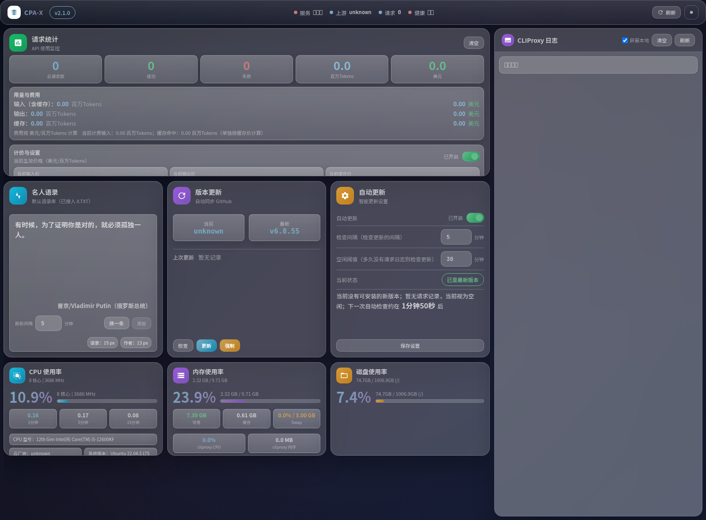
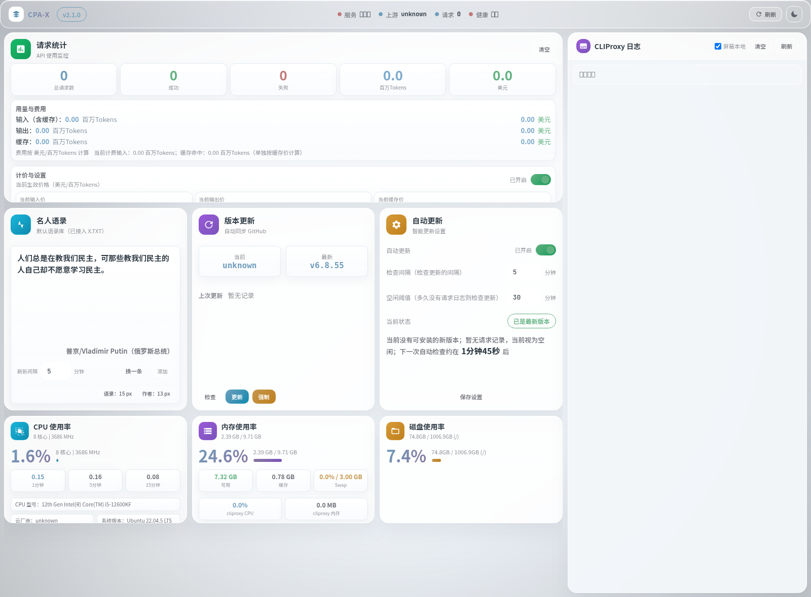

# CPA-X 管理面板（v2.2.0）

[English](README.md) | 中文

一个用于 **CLIProxyAPI** 的监控与管理面板，支持健康检查、资源监控、日志查看、更新管理、请求统计与定价显示等功能。

> 当前安全策略：前端已移除所有导出入口，主配置写回默认关闭；这个本地 hardened 版本还要求显式设置管理员账号口令后才能启动。

> **AI 优先**：本仓库主要面向 AI Agent 部署/运维。
- AI 部署手册：`AI_DEPLOY_CN.md`
- Agent 指引：`AGENTS.md`
- 更新说明：`RELEASE_NOTES_v2.2.0.md`

## 预览图

### 深色主题


### 浅色主题


## 适用环境
- 推荐：Linux
- Python 3.11+
- 需要能访问 CLIProxyAPI 的管理接口（默认 `http://127.0.0.1:8317`）

> Windows 也可以运行，但服务控制和自动更新能力会受限。

## 一条龙安装

### 推荐方式
```bash
bash scripts/install.sh

# 如需手动再跑一次自动探测（推荐）
python3 scripts/doctor.py --write-env
```

```powershell
powershell -ExecutionPolicy Bypass -File scripts/install.ps1
```

### 手动安装
```bash
git clone https://github.com/ferretgeek/CPA-X.git
cd CPA-X
python -m venv .venv
source .venv/bin/activate
pip install -r requirements.txt
cp .env.example .env
```

安装器和运行时都会拒绝使用仍包含 placeholder 的 `.env`。

重点配置：
- `CLIPROXY_PANEL_PANEL_USERNAME` / `CLIPROXY_PANEL_PANEL_PASSWORD`
- `CLIPROXY_PANEL_BIND_HOST`
- `CLIPROXY_PANEL_PANEL_ACCESS_KEY`
- `CLIPROXY_PANEL_CONFIG_WRITE_ENABLED`
- `CLIPROXY_PANEL_CLIPROXY_API_BASE` / `CLIPROXY_PANEL_CLIPROXY_API_PORT`
- `CLIPROXY_PANEL_MANAGEMENT_KEY` / `CLIPROXY_PANEL_MODELS_API_KEY`
- `CLIPROXY_PANEL_CLIPROXY_SERVICE` / `CLIPROXY_PANEL_CLIPROXY_BINARY`
- `CLIPROXY_PANEL_PRICING_*`
- `CLIPROXY_PANEL_PRICING_AUTO_*`
- `CLIPROXY_PANEL_GITHUB_TOKEN`

启动：

```bash
python app.py
```

访问：

```text
http://127.0.0.1:8080
```

健康检查：

```text
http://127.0.0.1:8080/healthz
```

## Docker / 容器部署

适合：监控、统计、模型、日志、配置读取/校验。

不适合：完整的 systemd 服务控制与自动更新。

仓库已提供：
- `Dockerfile`
- `docker-compose.yml`
- `.env.docker.example`
- 已发布镜像：`registry.maxsale.vn/tools/cpa-x:v2.2.0`

最短路径：

```bash
docker compose up -d --build
```

发布到 Registry：

```bash
REGISTRY_USERNAME=... REGISTRY_PASSWORD=... PUSH_LATEST=true ./scripts/publish-docker.sh
```

服务器使用已发布镜像更新：

```bash
docker pull registry.maxsale.vn/tools/cpa-x:v2.2.0
docker stop cpax-panel || true
docker rm cpax-panel || true
docker run -d --name cpax-panel --restart unless-stopped -p 8080:8080 registry.maxsale.vn/tools/cpa-x:v2.2.0
```

如果你需要日志、配置、auth 文件等功能，请把宿主机对应文件/目录挂载进容器，并把 `CLIPROXY_PANEL_*` 路径改成容器内路径。主配置写回默认仍是关闭状态。

## 常见问题

### 页面能打开但数据为空
检查 CLIProxyAPI 是否在运行，并确认 `.env` 中的管理接口地址/端口正确。

### 健康检查超时
`/api/status` 做的事情比 `/api/resources` 更多；想先验证基础可达性时可优先访问 `/api/resources`。

### systemd 功能不可用
在无 systemd 环境和大多数容器中，这是预期行为。

## 安全提示
- 不要提交 `.env`
- 管理密钥、模型密钥、面板访问密钥和管理员口令都应只放在 `.env`
- 默认监听 `0.0.0.0` 以方便局域网访问；如只本机使用，请设置 `CLIPROXY_PANEL_BIND_HOST=127.0.0.1`
- `CLIPROXY_PANEL_PANEL_ACCESS_KEY` 是给自动化和 upstream 兼容保留的一层额外 API 门槛
- 只有在你明确接受风险时，才设置 `CLIPROXY_PANEL_CONFIG_WRITE_ENABLED=true`

## 许可协议
MIT License（见 `LICENSE`）
